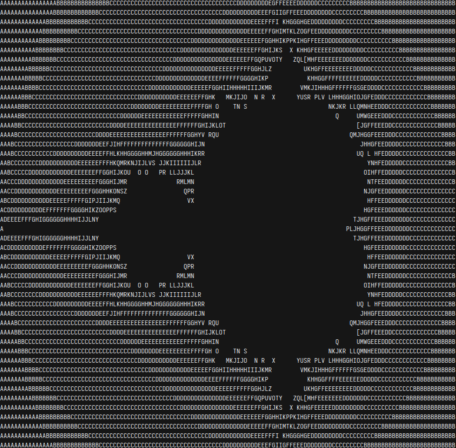

# cerebral

# Requirements
- make
- a c++23 compiler
# Usage
build the project
```bash
make
```
run bin/crbl providing it with a valid brainfuck program
```bash
bin/crbl mandelbrot.bf
```
# References
- [sunjay/brainfuck specification](https://github.com/sunjay/brainfuck/blob/master/brainfuck.md)
